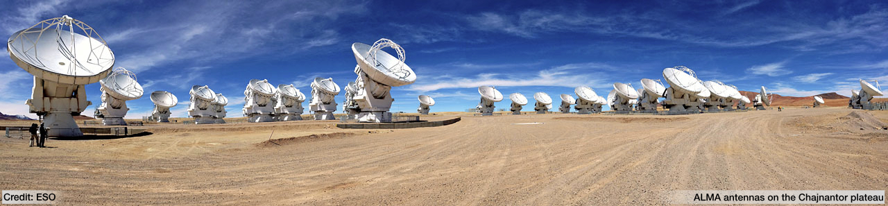

.. galario documentation master file, created by
   sphinx-quickstart on Wed May 24 13:32:58 2017.
   You can adapt this file completely to your liking, but it should at least
   contain the root `toctree` directive.

.. _maintainer: https://github.com/wjz070707

===================
|galario| |version|
===================

**GPU Accelerated Library for Analysing Radio Interferometer Observations**
---------------------------------------------------------------------------

.. important::

    **Context reuse is the central performance feature of GALARIO 1.3.**
    Create one ``create_image_context(...)`` before an optimizer or MCMC loop
    and pass it to every ``chi2_image`` or ``chi2_profile`` call. The Context
    keeps fixed observations, transform plans, and CPU/CUDA workspaces alive.
    Creating it inside the likelihood defeats this acceleration.

|galario| is a library that exploits the computing power of modern graphic cards (GPUs) to accelerate the comparison of model
predictions to radio interferometer observations. Namely, it speeds up the computation of the synthetic visibilities
given a model image (or an axisymmetric brightness profile) and their comparison to the observations.

Along with the GPU accelerated version based on the
`CUDA Toolkit <https://developer.nvidia.com/cuda-toolkit>`_, |galario| offers a CPU counterpart accelerated with
`openMP <http://www.openmp.org>`_.

Modern radio interferometers like
`ALMA <http://www.almaobservatory.org/en/home/>`_ and the
`Karl G. Jansky VLA <https://science.nrao.edu/facilities/vla>`_,
are pushing to the extreme the computational efforts needed to model the observations.
The unprecedented sensitivity and resolution achieved by these observatories deliver huge amount of data that sample a wide range of spatial frequencies.
In this context, |galario| provides a fast library useful for comparing a model to observations directly in the Fourier plane.

We presented |galario| in `Tazzari, Beaujean and Testi (2018) MNRAS 476 4527 <https://doi.org/10.1093/mnras/sty409>`_, where you can find all the details about the
relevant equations and the algorithm implementation.

.. Here we do not aim to summarize the vast literature about Radio Interferometry, but we refer the interested reader to the `Synthesis Imaging in Radio Astronomy II <http://aspbooks.org/a/volumes/table_of_contents/180>`_ book.

The maintained 1.3 line is developed on
`GitHub <https://github.com/wjz070707/galario_for_python3.13>`_
and has already been employed in :doc:`these publications <publications>`.

.. note::

    Version 1.3 uses a CMake, scikit-build-core, and nanobind source build.
    Historical binary packages may expose an older API. Current CPU and CUDA
    build instructions are in :doc:`Setup <install>`.

Basic functionality of |galario|: see the :doc:`Basic Usage <basic_usage>` page.

How to fit some data with |galario|: check the :doc:`Getting started example <quickstart>`.

Details on image orientation, coordinate systems and other assumptions: see the :doc:`Technical specifications <tech-specs>`.

Useful recipes for the CPU/GPU management and the model image creation: see the :doc:`Cookbook <cookbook>` with many code snippets.

Detailed documentation of each Python and C++ function: see the :doc:`Python-API <py-api>` and :doc:`C++ API <C++-api>` pages.

Stuck on an issue? Check the :doc:`Frequently Asked Questions <FAQ>` page or
contact the current `maintainer`_.

License and Attribution
-----------------------
If you use |galario| for your research please cite Tazzari, Beaujean and Testi (2018) MNRAS **476** 4527 `[MNRAS] <https://doi.org/10.1093/mnras/sty409>`_ `[arXiv] <https://arxiv.org/abs/1709.06999>`_ `[ADS] <http://adsabs.harvard.edu/abs/2018MNRAS.476.4527T>`_.

The BibTeX entry for the paper is::

    @ARTICLE{2018MNRAS.476.4527T,
       author = {{Tazzari}, M. and {Beaujean}, F. and {Testi}, L.},
        title = "{GALARIO: a GPU accelerated library for analysing radio interferometer observations}",
      journal = {\mnras},
    archivePrefix = "arXiv",
       eprint = {1709.06999},
     primaryClass = "astro-ph.IM",
     keywords = {methods: numerical, techniques: interferometric, submillimetre: general},
         year = 2018,
        month = jun,
       volume = 476,
        pages = {4527-4542},
          doi = {10.1093/mnras/sty409},
       adsurl = {http://adsabs.harvard.edu/abs/2018MNRAS.476.4527T},
      adsnote = {Provided by the SAO/NASA Astrophysics Data System}
    }

|galario| has also a `Zenodo DOI <https://doi.org/10.5281/zenodo.891039>`_, which can be used to refer to the exact
version of |galario| used in a paper.

|galario| is free software licensed under the LGPLv3 License. For more details see the :doc:`LICENSE <license>`.

Copyright 2017-2020 Marco Tazzari, Frederik Beaujean, Leonardo Testi and
contributors. Copyright 2026 wjz070707.

Contributors
------------
.. include:: ../AUTHORS.rst

Changelog
---------
.. include:: ../CHANGELOG.rst

Contents
--------
.. toctree::
    :numbered:
    :maxdepth: 2

    Home <self>
    Setup <install>
    Basic Usage <basic_usage>
    Getting Started <quickstart>
    emcee 3 Tutorial <emcee_tutorial>
    Reproducible Research <reproducibility>
    Tech specs <tech-specs>
    Architecture <architecture>
    Cookbook <cookbook>
    Python API <py-api>
    C++ API <C++-api>
    C++ Example <C++-example>
    Publications <publications>
    FAQ <FAQ>
    License <license>
